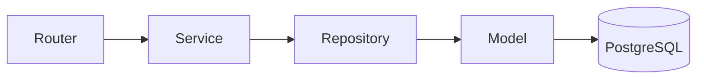

<!-- Header animado (capsule-render) -->
<div align="center">


<!-- Texto que se escribe solo (readme-typing-svg) -->
<a href="https://github.com/Alejandroesbr">
  
</a>

<br/>

<a href="https://linkedin.com/in/alejandroesbr"></a>
<a href="mailto:alejandroescobare@outlook.com"></a>
<a href="https://github.com/Alejandroesbr/portafolio"></a>

</div>

<br/>

## 👨‍💻 About me

```python
class AncizarEscobar:
    role = "Software Engineer"
    location = "Barranquilla, Colombia 🇨🇴"
    languages = {"Spanish": "native", "English": "B2+ (professional)"}
    
    education = [
        "B.S. Software Engineering: Universidad Manuela Beltrán (2024 - present)",
        "Software Development Program: Riwi (2026 - present)",
    ]
    
    # Unique value proposition: combines technical expertise with strong interpersonal skills
    strengths = [
        "Backend development (Python, Node.js, SQL)",
        "Customer empathy & communication",
        "Working under pressure & attention to detail",
        "Technical documentation & collaboration",
        "Problem-solving with user-centered approach"
    ]
    
    focus = [
        "REST APIs & backend systems",
        "Authentication (JWT) & relational data models", 
        "Layered architecture: Router → Service → Repository → Model",
        "Database migrations & containerized environments",
        "Building software that serves real human needs"
    ]
    
    def currently(self):
        return {
            "building": "Riwi Cine API (Node.js + TypeScript + Express)",
            "studying": "Software Engineering + Riwi program", 
            "open_to": "Junior backend opportunities where I can grow 🚀",
            "bringing": "Years of customer service experience to technical challenges"
        }
        
    def __str__(self):
        return "Engineer who believes great software starts with understanding people"
```

<br/>

## 🛠️ Tech stack

<div align="center">


<br/><br/>


</div>

<br/>

<table style="width:100%; border-collapse:separate; border-spacing:0 10px;">
  <tr>
    <th style="text-align:left; padding-right:20px; width:30%; font-weight:600;">Languages</th>
    <td>Python · TypeScript · JavaScript (ES6+) · SQL</td>
  </tr>
  <tr>
    <th style="text-align:left; padding-right:20px; width:30%; font-weight:600;">Backend</th>
    <td>FastAPI · Node.js · Express · REST APIs · JWT · SQLAlchemy · Sequelize</td>
  </tr>
  <tr>
    <th style="text-align:left; padding-right:20px; width:30%; font-weight:600;">Databases</th>
    <td>PostgreSQL · MySQL</td>
  </tr>
  <tr>
    <th style="text-align:left; padding-right:20px; width:30%; font-weight:600;">DevOps & tools</th>
    <td>Docker · Docker Compose · Git / GitHub · Linux · Postman · Alembic</td>
  </tr>
  <tr>
    <th style="text-align:left; padding-right:20px; width:30%; font-weight:600;">Engineering</th>
    <td>Layered Architecture · Repository Pattern · SOLID · MVC · API Design · Git Flow</td>
  </tr>
  <tr>
    <th style="text-align:left; padding-right:20px; width:30%; font-weight:600;">Methodologies</th>
    <td>Agile · Scrum · Collaborative development · Technical documentation</td>
  </tr>
  <tr>
    <th style="text-align:left; padding-right:20px; width:30%; font-weight:600;">Professional Skills</th>
    <td>Customer Empathy · Communication Under Pressure · Attention to Detail · Documentation · Collaboration</td>
  </tr>
</table>

<br/>

## 🚀 Featured projects

### 🧭 [TourPoints Backend](https://github.com/TourPoints/TourPoints-Backend)

`FastAPI` `PostgreSQL` `SQLAlchemy` `Alembic` `JWT` `Docker`

Backend for a gamified tourism platform, built collaboratively with another developer using separated feature ownership.

- Developed REST API functionality with **FastAPI**, **PostgreSQL** and **SQLAlchemy**.
- Implemented **JWT authentication** and contributed to the layered architecture below.
- Managed schema evolution with **Alembic** and containerized the environment with **Docker**.
- Built the business logic for the **rewards system** and an **append-only points ledger** to record and track point transactions.



### 🎬 [Riwi Cine API](https://github.com/riwi-cine/riwi--cine-backend) _(in progress)_

`Node.js` `TypeScript` `Express` `PostgreSQL` `Sequelize`

Collaborative RESTful backend built as part of the Riwi program, working in a shared Git/GitHub workflow.

- Modular backend development: relational data modeling, API design and business logic.
- Applying customer service insights to create intuitive API responses and error messages.
- Practicing collaborative development patterns learned through Riwi program.

<br/>

## 📍 Journey

<table style="width:100%; border-collapse:separate;">
  <tr>
    <th style="text-align:left; padding-right:20px; width:30%; font-weight:600; border-bottom:2px solid #30363d;">When</th>
    <th style="text-align:left; padding-right:20px; width:70%; border-bottom:2px solid #30363d;">What</th>
  </tr>
  <tr>
    <td style="padding-top:15px; padding-bottom:15px; border-bottom:1px solid #21262d;">**2026 → now**</td>
    <td style="padding-top:15px; padding-bottom:15px; border-bottom:1px solid #21262d;">🎓 Riwi: Software Development Program</td>
  </tr>
  <tr>
    <td style="padding-top:15px; padding-bottom:15px; border-bottom:1px solid #21262d;">**2024 → now**</td>
    <td style="padding-top:15px; padding-bottom=15px; border-bottom:1px solid #21262d;">🎓 B.S. in Software Engineering, Universidad Manuela Beltrán</td>
  </tr>
  <tr>
    <td style="padding-top:15px; padding-bottom:15px; border-bottom:1px solid #21262d;">**2025**</td>
    <td style="padding-top:15px; padding-bottom:15px; border-bottom:1px solid #21262d;">🎧 Customer Support Specialist @ OP360: bilingual support against service-level KPIs, Zoho CRM & RingCentral</td>
  </tr>
  <tr>
    <td style="padding-top:15px; padding-bottom:15px; border-bottom:1px solid #21262d;">**2024**</td>
    <td style="padding-top:15px; padding-bottom:15px; border-bottom:1px solid #21262d;">🩺 Healthcare Customer Support @ Atlantic Quantum Innovations: high-volume bilingual support, referrals and CRM accuracy</td>
  </tr>
</table>

> Before writing code full time, I spent two years working with international customers in English and Spanish. This experience taught me:
> - **Communication**: Translating technical concepts for non-technical users
> - **Empathy**: Understanding user frustrations and needs
> - **Attention to detail**: Accuracy in high-volume, high-stakes environments
> - **Working under pressure**: Maintaining quality during peak loads
> 
> I bring these interpersonal skills into how I document, collaborate, and build backend systems that serve real human needs.

<br/>

## 📊 GitHub stats

<div align="center">


<br/>


</div>

<br/>

## 🥋 Off the keyboard

Brazilian Jiu-Jitsu and kickboxing. Former barista and bartender. Currently hunting for a third language.

<br/>

<div align="center">

**Let's build something that works — for real people.** 📬 [alejandroescobare@outlook.com](mailto:alejandroescobare@outlook.com)


</div>